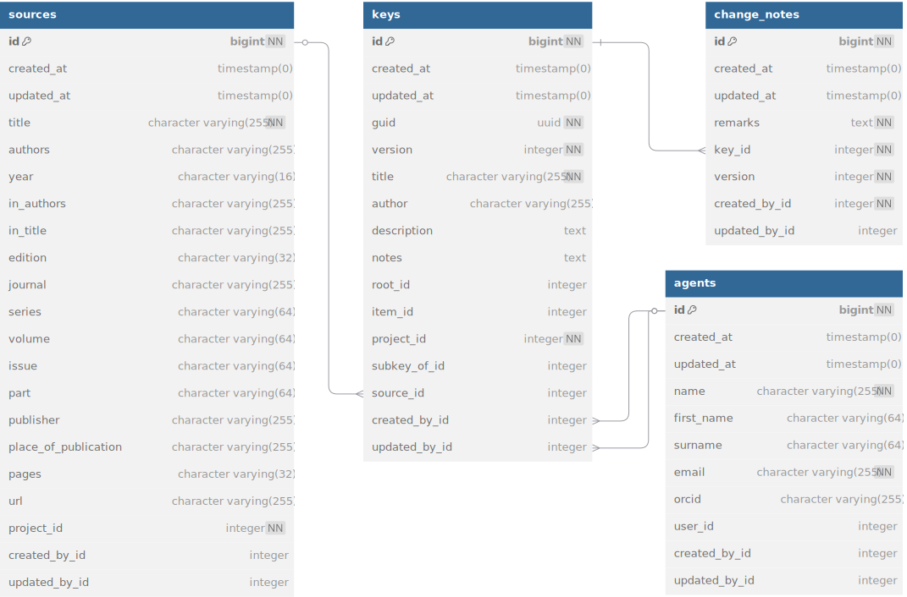

# KeyBase data model

## Key

Keys are the core of KeyBase. To make keys work, we need three things (tables), **keys**, **leads** and **items**.

A key is a graph of leads, so the **leads** table contains an adjacency list
made up by the `id` and `parent_id` fields. The lead itself is in the
`lead_text` field.

In most cases the graph will be a tree (a graph with no cycles). KeyBase
currently enforces that. In KeyBase, the branches of the tree are **leads** and
the leaves are **items**, which the **leads** are related to with the `item_id`
field. An **Item** can be the root of another **Key**. This is done in KeyBase
through the `item_id` and `root_id` fields in the **keys**
table. The `item_id` field links to the **items** table and the
`root_id` field to the **leads** table (so that is really the root).

There are two types of situations where the tree structure breaks down, or where
there are other types of leaves:

1.  **Sub-keys:** Large keys are often broken down into smaller sub-keys, e.g.
    https://keybase.rbg.vic.gov.au/keys/show/3854. In the KeyBase data model we
    have the `subkey_id` field in the **leads** table to deal with this. When
    using this, we basically skip the **Item** and go straight to the **Key**.

    The KeyBase plugin currently does not support sub-keys, so until now people
    have had to make up items and have the sub-key as a key with a taxonomic
    scope (which is why `taxonomic_scope_id` is required), but we can support it
    in the data model and provide a custom API endpoint for use with the KeyBase
    plugin until the plugin has been updated.

2.  **Reticulations:** Sometimes multiple leads lead to the same next lead,
    causing a cycle (or 'reticulation') in the graph. The KeyBase plugin
    currently does not support reticulations, so when a new key is loaded into
    the database KeyBase will just pretend they are not there and duplicate a
    branch as many times as is needed (which is what a recursive query with
    `UNION ALL` would do).

There are also scenarios where an **Item** is not a leaf but a branch (or a
branch as well as a leaf):

1.  **Missing intermediate keys:** An item that keys out in a key might have
    only a single immediately subordinate item, so there will not be a key for
    that item. This single subordinate item, however, might have multiple
    subordinates of its own, so it might have a key. This creates a gap in the
    key hierarchy, which becomes a problem when people want to create a filter
    (see [Filters](#filters) section), as keys will not link up anymore.

    There are two ways this situation can be resolved. The first is to create a
    key with a single lead for the item. The second is to add this lead to the
    key the item keys out in. KeyBase supports both these solutions. For the
    latter solution KeyBase allows the construction `<item>:<subordinate item>`,
    e.g. 'Ginkgoaceae: Ginkgo biloba' (which skips two keys), in the 'to' column
    of the input file.

2.  **References to items in other keys:** When KeyBase allowed people to add
    additional items in the 'to' column, people were quick to work out that this
    could be used for other things as well. So, if an item keyed out in more
    than one place in a key, people would add the subordinate item(s) that would
    really key out in that particular spot. This broke KeyBase, which is why I
    came up with the extra lead idea, rather than trying to deal with it in the
    item, like I did before. This is more flexible, so now it is possible to add
    more than one subordinate item, e.g., 'Adoxaceae: Sambucus, Viburnum', as
    well.

    In theory it is possible for leads to have an item and the key to continue,
    which is something you sometimes see in printed keys, e.g. '...**2 (sect.
    Camptocheate)**...**5 (sect. Thamniella)**', but I am not sure whether
    someone has tried that in KeyBase or what KeyBase would do with it if
    someone tried. The better practice here is to add the item name to the
    `lead_text`, especially since there is generally no link on these items and
    there will also be no keys to the members of these items, so there is no
    reason to have the item in KeyBase.

## Extra key metadata

There are some extra tables with metadata for keys that are required for
attribution and change management, but that have no effect on how keys work.

The **sources** table is used for metadata of the publication if the key was
published somewhere else.

The **change_notes** table is used for notes about changes that were made when
people upload a new version of the key (so, a new CSV file). These change notes
are comparable to commit messages in version management systems. The change
notes actually apply to a version of the key, so there is a `version` column in
both the **keys** and **change_notes** tables, but I do not want composite keys,
so we have to add a business rule when the records are created, so that the
versions line up. 

The **keys** table, and every other table that is not merely a pivot table, has
`created_by_id` and `updated_by_id` columns that are foreign keys to the
**agents** table. These indicate who created and who last updated the key. Each
table also has `created_at` and `updated_at` columns to indicate when records
were created and last modified.

## Organisation

KeyBase manages keys for several different projects and keys and items (and also
filters) are managed at the project level. Also authorisation for data
manipulation actions is managed at the project level.

This provides a level of encapsulation that makes that projects can trust that
KeyBase handles their keys well and that users from outside can not make changes
to their keys. If people want to use a key from another project in their own
project, they can just export that key and import it in their project, analogous
to forking a repository in GitHub. KeyBase does not have a mechanism for that,
so people need to do that manually and manage attribution etc. themselves.
People are also free to create projects outside KeyBase in which they bring
together keys from different projects, provided they provide the necessary
attribution (not to KeyBase but to the makers of the key).

There is an **agents** table in the data model which has a record for every
user. The **agents** table is linked to from every other table that is not
merely a pivot table through the `created_by_id` and `updated_by_id` fields.
This provides the blamable. The advantage of having an **agents** table are
mainly looking into the future, as it separates the blamable from the
authorisation and people's user accounts can be deleted without affecting
anything else in KeyBase (except the **agents** table itself, which we have to
do something about). The **agents** table can also be used to store extra
metadata about agents, such as people's ORCIDs (for attribution rather than
authentication purposes).

## Filters

The filters in KeyBase are a feature that I really hate and regret I ever
implemented, but that KeyBase users really like, so unfortunately we cannot do
away with it. From a software persepective it is also a pretty nice feature.

KeyBase has two types of filters, local filters and global filters. The local
filters are entirely handled within the KeyBase plugin and are ephemeral, so
they do not feature in the data model.

The global filters are in the data model, where we just call them **filters**.

Filters are created by uploading a list of item names. We just have people enter
them in a text area, separated by line breaks. Nothing more fancy is needed.
KeyBase tries to match the names to items in KeyBase and then stores these items
(or their IDs). Names that cannot be matched to items in KeyBase are listed in
the `items_not_found` field (which is just a string). This way, when the item is
added to a key the filter can be updated and one does not have to upload a new
list of names.

KeyBase only stores the items in the filter and not the keys that are needed to
key out all these items or what items are in what keys (I tried all that; much
too hard to maintain). Filters link to **keys** via the **items** and **leads**
tables, so one step too much for a simple many-to-many relationship, but
**keys** can be accessed directly from the **filters** in the ORM. Not sure if
we can do everything we need to make filters work in the ORM, so we'll have to
see how useful this is.

Filters can be applied and turned off on the **Project** page. When a filter is
applied only the keys that are necessary to key out the items in the filter are
displayed. Also, when a filter is on, the **Key** page will only show the items
that are in the filter or are necessary to get to the keys that have items that
are in the filter. This can be overridden in the local filter dialogue, but when
people then navigate to another key that key will only have the filtered items
unless or until the filter is turned off (which I think can be done on the
**Key** page). This is the "global" aspect of the filters. They are global in
the sense that they affect the entire application; they are not global in the
sense that they can contain keys and items from anywhere in KeyBase, as they can
only contain items from a single project.

There are two types of global filters in KeyBase: project filters and user
filters. Project filters can be created by project managers—by checking the
`is_project_filter` check box—and are accessible to all users (logged in or
not). User filters can be created by all logged in users and are only visible by
those users themselves.

## Entire schema

Relationships to the `agents` table that all tables have through their
`created_by_id` and `updated_by_id` fields have been left out.

