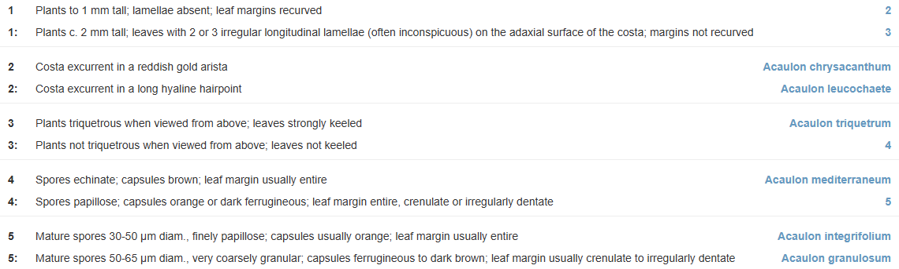
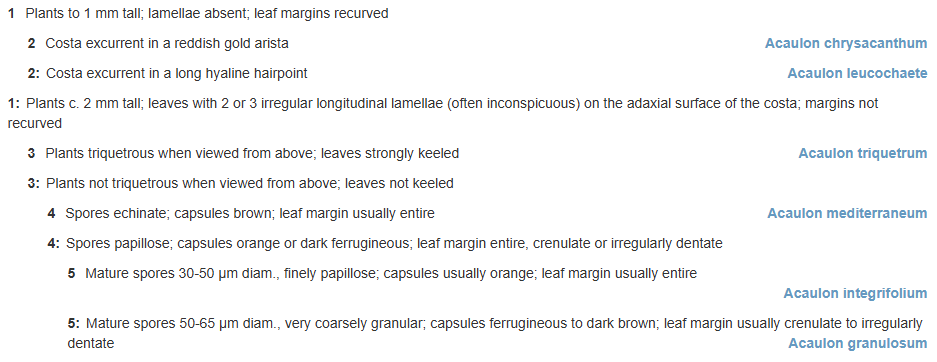

# Processing keys

## Anatomy of an identification key

The pathway keys—or dichotomous keys—that are managed in KeyBase, and have been
published in the literature for the last 200 years or so, come in two main
forms, both of which can be reproduced by KeyBase.

Most keys in the literature, at least the botanical literature, are bracketed
keys (**figure 1**). In a bracketed key the key is divided in couplets, each couplet
having two leads. Each lead starts with the number of the couplet, followed by a
statement and then by either the number of the next couplet to go to or the
result of the identification.



<caption>

**Figure 1.** Bracketed key from **KeyBase (2025)**. _Flora of Victoria: Key to
Acaulon species_. &lt;https://keybase.rbg.vic.gov.au/keys/show/12181&gt; [Seen:
24-05-2025]. https://keybase.rbg.vic.gov.au/keys/show/12181?mode=bracketed

</caption>

Another often-used format is the indented key (**figure 2**). In an indented key
the next couplet a lead leads to follows immediately below the lead. Because of
this it is not necessary to show the number of the next couplet. In fact couplet
numbers are not necessary at all, as the indentation takes care of that.
However, larger keys become hard to follow without the numbers or even with the
numbers. Therefore, for larger keys the bracketed format is the better format
(but this is subject to personal opinion).



<caption>

**Figure 2.** Same key as in figure 1 displayed as an indented key.
https://keybase.rbg.vic.gov.au/keys/show/12181?mode=indented

</caption>

Keys can be represented as the decision tree in **figure 3**. The graph in
figure 3 has the structure of the key in figures 1 and 2, but the taxon names
have been replaced by numbered item labels and the statements of the leads are
not shown.

 

<caption>


**Figure 3.** Graph of key in figures 1 and 2. In this graph the circles are couplets,
arrows are leads and rectangles are the keyed out items (identification results). 

</caption>

A key is a graph, but the vertices and edges in this graph are not the nodes and
relationships of graph databases. All the data is in the leads and the vertices
are not so much entities as branching points. So, in KeyBase, the leads are the
entities and are stored as records. Leads (Lead records) are linked through the `parent`
(`parent_id` in the database) property (figure 4B). Couplets, in KeyBase, are
data constructs, i.e. sets of (almost always two) leads with the same parent.

<br>


<caption>

**Figure 4.** Conversion of decision tree to graph of leads that is stored in
KeyBase.

</caption>

If we split the graph into couplets (**figure 5**) we can see that a lead either
has an item or is the parent of another couplet of leads. There are a few
exceptions to this rule as will be discussed, but KeyBase has gotten by very
well for 15 years without implementing these exceptions.


<caption>

**Figure 5.** Bracketed key in the KeyBase data model, showing couplets.

</caption>

While the bracketed key format lends itself better for exchange and
dissemination, the indented format (**figure 6**) is closer to the way the key
is stored in the database and might be better for illustrating what is going on.


<caption>

**Figure 6.** Indented key in the KeyBase data model, showing nested sets.

</caption>

The boxes outlined with a broken line in (**figure 6**) are nested sets. Nested
sets can be stored in the database by storing the numbers in the top- and
bottom-right corners of the boxes as `left` and `right`. KeyBase currently
still stores the nested sets in the database, but for the last ten years, nested
sets have been created by the plugin, so it is not necessary to store them in
the database anymore. This makes KeyBase more flexible in what it can do with
keys. Nested sets are used in the KeyBase player to get the remaining and
discarded items. So, for couplet **3** in figure 6 remaining items are the items
on the leads of which the value of `left` is between 8 and 21 and the discarded
items where it is not. Nested sets also make the filters work.

The bracketed format lends itself very well to exchange as tabular data (**table
1**), which is why CSV is the preferred format for importing and exporting keys
in KeyBase. From now on KeyBase will only support tabular data, which can be CSV
or Excel. KeyBase used to support two XML formats, SDD and LPXK, but other
applications that people stopped using when KeyBase came onto the
scene are needed to produce data in these formats, so they are used very little.

<caption>

**Table 1** Key from figures 1 and 2 as tabular data<sup>1</sup>.

</caption>

from | statement | to
-|-|-
1 | Plants to 1 mm tall; lamellae absent; leaf margins recurved | 2
1 | Plants c. 2 mm tall; leaves with 2 or 3 irregular longitudinal lamellae (often inconspicuous) on the adaxial surface of the costa; margins not recurved | 3
2 | Costa excurrent in a reddish gold arista | Acaulon chrysacanthum
2 | Costa excurrent in a long hyaline hair-point | Acaulon leucochaete
3 | Plants triquetrous when viewed from above; leaves strongly keeled | Acaulon triquetrum
3 | Plants not triquetrous when viewed from above; leaves not keeled | 4
4 | Spores echinate; capsules brown; leaf margin usually entire | Acaulon mediterraneum
4 | Spores papillose; capsules orange or dark ferrugineous; leaf margin entire, crenulate or irregularly dentate | 5
5 | Mature spores 30-50 µm diam., finely papillose; capsules usually orange; leaf margin usually entire | Acaulon integrifolium
5 | Mature spores 50-65 µm diam., very coarsely granular; capsules ferrugineous to dark brown; leaf margin usually crenulate to irregularly dentate | Acaulon granulosum

<sup>1</sup> [Data in this table as CSV](./examples/key-import-example.csv)

In its simplest (and most common) form, the CSV for a key will have three
columns, `from`, `statement` and `to`. Note that currently the CSV files that
can be imported into and exported from KeyBase do not have column headers. In
the new version the exports will have column headers but a large part of the
imported files will not, so a script that deals with the uploaded files will
need to check whether there are column headers or not (just by checking if the
first value in the first row is numeric or not) and, if there are not, add the
three abovementioned column headers.

When the CSV file has been processed you end up with a collection like below (I
think KeyBase might ship the data between the frontend and backend as JSON, but
I am not sure).

```php
$inKey = collect([
    [
      "from" => 1,
      "text" => "Plants to 1 mm tall; lamellae absent; leaf margins recurved",
      "to" => 2,
    ],
    [
      "from" => 1,
      "text" => "Plants c. 2 mm tall; leaves with 2 or 3 irregular longitudinal lamellae (often inconspicuous) on the adaxial surface of the costa; margins not recurved",
      "to" => 3,
    ],
...,
    [
      "from" => 5,
      "text" => "Mature spores 30-50 µm diam., finely papillose; capsules usually orange; leaf margin usually entire",
      "to" => "Acaulon integrifolium",
    ],
    [
      "from" => 5,
      "text" => "Mature spores 50-65 µm diam., very coarsely granular; capsules ferrugineous to dark brown; leaf margin usually crenulate to irregularly dentate",
      "to" => "Acaulon granulosum",
    ],
  ])
```

Before the validation and uploading of the key, we create arrays with the values
of the 'from' and 'to' columns (you do not have to do that, but it is how I did
it).

```bash
> $from = $inKey->map(fn ($lead) => $lead['from']);
= Illuminate\Support\Collection {#5180
    all: [
      1,
      1,
      2,
      2,
      3,
      3,
      4,
      4,
      5,
      5,
    ],
  }
```

```bash
> $to = $inKey->map(fn ($lead) => $lead['to']);
= Illuminate\Support\Collection {#5237
    all: [
      2,
      3,
      "Acaulon chrysacanthum",
      "Acaulon leucochaete",
      "Acaulon triquetrum",
      4,
      "Acaulon mediterraneum",
      5,
      "Acaulon integrifolium",
      "Acaulon granulosum",
    ],
  }
```

The array for the 'to' column needs to be split into couplets and items. KeyBase
uses the convention that couplet indexes are always numeric (in literature
sometimes letters or roman numerals are used), so the numbers are couplets and
the strings items.

```bash
> $toCouplets = $to->filter(fn ($item) => is_numeric($item));
= Illuminate\Support\Collection {#5210
    all: [
      0 => 2,
      1 => 3,
      5 => 4,
      7 => 5,
    ]
  }
```

```bash
> $toItems = $to->filter(fn ($item) => !is_numeric($item));
= Illuminate\Support\Collection {#5241 
    all: [
      2 => "Acaulon chrysacanthum",
      3 => "Acaulon leucochaete",
      4 => "Acaulon triquetrum",
      6 => "Acaulon mediterraneum",
      8 => "Acaulon integrifolium",
      9 => "Acaulon granulosum",
    ]
  }
```


## Things to look out for

There are (quite) a few exceptions from the ideal key structure illustrated
above that we need to look out for when validating keys and for some that are
not errors also when uploading the keys. They are reported back to the user with
the standard debug messages 'Error', 'Warning' and 'Info'. 

Errors break the key, so keys with errors will not be uploaded. Warnings do not
break the tree but are not good practice and might not have been the intention
of the user, so we let the user decide. If there are no debug messages to report, the
key can just be uploaded without further feedback from the user.
Currently the first screen only reports which delimiter was used. I think we can
skip that as well.

### Singletons [**Error**]


<caption>

**Figure 7.** Graph of key with singleton couplet. [[Example CSV
import](./examples/key-import-singleton-example.csv)]

</caption>

Couplets with a single lead serve no purpose in the key and are errors. They
might also interfere with the rendering of the key later on, as they are not
expected.

To find singletons in a key:

```bash
> $singletons = $from->countBy()->filter(fn ($value) => $value == 1)->keys()->all();
= [
    6,
  ]
```

To check if a lead is a singleton:

```php
$isSingleton = $from->filter(fn ($value) => $value == $inKey[$i$]['from'])->count() == 1
```


### Polytomies [**Warning**]


<caption>

**Figure 8.** Graph of key with polytomy. [[Example CSV import](./media/decision-tree-polytomy.drawio.svg)]

</caption>

Polytomies, i.e. couplets with more than two leads, are harmless, but they are
not considered good practice and they may have gone into or been left in the key
by accident, so we issue a warning.

To find polytomies in a key:

```bash
> $polytomies = $from->countBy()->filter(fn ($value) => $value > 2)->keys()->all();
= [
    5,
  ]
```

To check if a lead with index `$i` is part of a polytomy:

```php
$isPolytomy = $from->filter(fn ($value) => $value == $inKey[$i]['from'])->count() > 2;
```


### Orphans [**Error**]


<caption>

**Figure 9.** Graph of key with orphan couplet. [[Example CSV
import](./examples/key-import-orphan-example.csv)]

</caption>

Orphans are couplets, except the first couplets, that are not in the 'to'
column, so people using the key cannot get to them.

To find orphans in a key:

```bash
> $orphans = $from->diff($toCouplets)->slice(1)->all();
= [
    6,
  ]
```

To check if a lead with index `$i` is an orphan:

```php
$isOrphan = $toCouplets->filter(fn ($value) => $value == $inKey[$i]['from'])->count() == 0;
```


### Dead ends [**Error**]


<caption>

**Figure 10.** Graph of key with dead end. [[Example CSV
import](./examples/key-import-dead-end-example.csv)]

</caption>

Dead ends are the opposite of orphans. They are couplet numbers in the 'to'
column without couplets. They are mostly the result of typos (as are orphans).

To find dead ends in a key:

```bash
> $deadEnds = $toCouplets->diff($from)->all();
= [
    7,
  ]
```

To check if a lead is a dead end:

```php
$isDeadEnd = is_numeric($inKey[$i]['to']) && $from->filter(fn ($value) => $value == $inKey[$i]['to'])->count() == 0;
```


### Loops [**Error**]


<caption>

**Figure 11.** Graph of key with loop. [[Example CSV
import](./examples/key-import-loop-example.csv)]

</caption>

Loops are created when a lead points back to a couplet that is on the path
already taken. Loops are the biggest problem when uploading a key, as new leads
are created until the system has run out of memory, and they are also the
hardest to find, as one has to traverse the key to find them.

```php
class ErrorCheckService extends Service {
    private $from;
    private $to;
    private $loops;

    public function __construct($inKey)
    {
        $this->from = $inKey->map(fn ($lead) => $lead['from']);
        $this->to = $inKey->map(fn ($lead) => $lead['to']);
    }

    public function checkForLoops()
    {
        $this->loops = collect([]);
        $this->traverseKey(collect([]), $this->from[0]);
        return $this->loops;
    }
    
    private function traverseKey($path, $couplet) 
    {
        $path->push($couplet);
        
        foreach ($this->from->filter(fn ($value) => $value == $couplet)->keys() as $lead) {
            $goTo = $this->to[$lead];
            if ($goTo) { // not an orphan 
                if ($this->from->contains($goTo)) { // goTo is a couplet (not an item)
                    if ($path->contains($goTo)) { // goTo is on path: append to loops array
                        $this->loops->put($lead, $goTo);
                    }
                    else { // goTo is not on path: go to next couplet
                        $this->traverseKey($path, $goTo);
                    }
                }
            }
        }
    }
}

$service = new ErrorCheckService($inkey)
```

To check for loops in a key:

```bash
> $loops = $service->checkForLoops();
= Illuminate\Support\Collection {#5307
    all: [
      7 => 6,
    ]
  }
```

To check if a lead with index `$i` creates a loop:

```php
$isLoop = $loops->get($i);
```


### Reticulations [**Warning**]


<caption>

**Figure 12.** Graph of key with reticulation. [[Example CSV import](./examples/key-import-reticulation-example.csv)]

</caption>

Reticulations are created when multiple leads go to the same couplet.
Reticulations do no harm but, if ignored, lead to a different key than the user
expects, so we need to catch them and deal with them properly.

There are two ways of dealing with reticulations. One is repeating the sub-graph
as many times as needed to repair the tree structure (**figure 13**). This is
what KeyBase does now and is the same as not dealing with reticulations. 


<caption>

**Figure 13.** Graph of key with reticulation resolved by repeating the sub-graph.

</caption>

Possibly a better way of dealing with reticulations is starting a new graph
(**figure 14**). This involves creating a new root lead that the leads leading
to the couplet link to with the `reticulation` (`reticulation_id` in the
database) property. So this is one of the exceptions to the rule that leads
either have an item or are the parent of another set of leads.


<caption>

**Figure 14.** Graph of key with reticulation resolved by starting a new graph.

</caption>

Reticulations when dealt with this way will cause problems later on, as keys
with reticulations cannot be displayed as indented keys and for that reason will
also not be able to be edited when KeyBase gets a key editor. For this reason,
we will not treat reticulations as a feature and will keep ironing out
reticulations and warn people about them like KeyBase has always done. 

This will find reticulations in a key:

```bash
> $reticulations = $toCouplets->countBy()->filter(fn ($value) => $value > 1)->keys()->all();
= [
    2,
  ]
```

To check if a lead with index `$i` is in a reticulation:

```php
$isReticulation = is_numeric($inKey[$i]['to']) && $toCouplets->filter(fn ($value) => $value == $inKey[$i]['to'])->count() > 1;
```


### Sub-keys [**Info**]


<caption>

**Figure 15.** Key with sub-keys.

</caption>

Large keys, of which we have quite a few in KeyBase, are often split into
smaller sub-keys (**figure 15**). Currently KeyBase does not deal with sub-keys,
but merging sub-keys into one big key is the largest (and perhaps only)
source of reticulations, so it is a high priority for me to fix this in the new
version. Sub-keys are much more straightforward to deal with than and are much
preferable to reticulations and if KeyBase can deal with sub-keys, we might not
need special treatment for reticulations.

CSV files for keys with sub-keys need a fourth 'subkey' column. Therefore they
need to have a header row, otherwise KeyBase will ignore this column.

[[Example CSV of key with sub-keys](./examples/keybase-import-key-with-subkeys-example.csv)]

To find sub-keys in a key:

```bash
> $hasSubkeys = $inKey->filter(fn ($lead) => isset($lead['subkey']))->count() ? true : false;
= true
```

```bash
> $subkeyLabels = $inkey->map(fn ($lead) => $lead['subkey'])->unique()->values();
= Illuminate\Support\Collection {#5102
    all: [
      "Subkey 1",
      "Subkey 2",
      "Subkey 3",
    ]
  }
```

If a key has sub-keys, it needs to split up into a main key and sub-keys:

```php
$subkeys = [];

$subkeys['main'] = $inKey->filter(fn ($lead) => !isset($lead['subkey']));

foreach ($subkeyLabels as $label) {
    $subkeys[$label] = $inkey->filter(fn ($lead) => isset($lead['subkey']) && $lead['subkey'] == $label);
}
```

In the main key, non-numeric values in the `$to` collection can be either
sub-keys or items:

```bash
> $to = $subkeys['main']->map(fn ($lead) => $lead['to']);
= Illuminate\Support\Collection {#5217
    all: [
      "Subkey 1",
      2,
      "Subkey 2",
      "Subkey 3",
    ]
  }

> $toItems = $to->filter(fn ($item) => !is_numeric($item))->diff($subkeyLabels);
= Illuminate\Support\Collection {5281 
    all: []
```

To check if a lead with index `$i` goes to a sub-key:

```php
$hasSubkey = $subkeyLabels->filter(fn ($value) => $value == $inKey[$i]['to'])->count() > 0;
```

### Shortcut [**Info**]

Often an item that keys out only has a single member (in the project), so there
will not be a key for this item. However, this member itself can have multiple
members, so can have a key to its members. In order to still be able to link
this key to the present key, KeyBase has a data structure we call a 'shortcut'
(from now on). A shortcut is a lead with an item. The parent of the shortcut is
the lead with the keyed-out item (**figure 16**).


<caption>

**Figure 16.** Couplet with shortcut
`:Senegalia greggii` in **KeyBase (2025)**, _Vascular plants of
California: Jepson Herbarium, UC Berkeley: Fabaceae Group 1_.
&lt;https://keybase.rbg.vic.gov.au/keys/show/10038&gt; [Seen: 26-05-2025].

</caption>

In the key file shortcuts can be provided by appending a colon (':') and an item
name, e.g. `:Senegalia greggii`, to an item name in the `to` column. (People
will be tempted to put a space after the colon, so we should account for that
when parsing a key).

To check if there are any shortcuts in a provided key, you can run:

```php
$shortcuts = $toItems)->filter(fn ($value) => substr_count($value, ':'))->all();
```

And for a single lead:

```php
$hasShortcut = substr_count($inKey[$i]['to'], ':') ? true : false;
```

### Chained shortcuts [**Error**]

There are a few instances in KeyBase where people have tried to chain shortcuts.
While chained shortcuts do not break anything, KeyBase does not treat them as
shortcuts but will export and display them as extra leads (which is what they
are), which is not what the author of the key intended and will confuse other
users. Also, shortcuts are meant to connect keys, not link extra items to keys
(I did call them linked items before, which might have given people that idea).

So, from now on, we will report chained shortcuts as errors.

To find chained shortcuts in a provided key, you can run:

```php
$chainedShortcuts = $toItems->filter(fn ($value) => substr_count($value, ':') > 1)->all();
```

And for a single lead:

```php
$hasChainedShortcut = substr_count($lead['to'], ':') > 1 ? true : false;
```

### Unfinished keys [**Warning**]

Unfinished keys are keys where not every item keys out, so they have multiple
items coming from the same lead. Multiple items from the same lead could be
delivered in the import CSV by separating item labels with a comma. To my
knowledge nobody has ever tried this and KeyBase will not support it. We will
just send people a warning that KeyBase will treat this as a single item (which
might be fine for some people). We might have to reconsider this in UAT.

To find leads with multiple items:

```bash
> $multipleItems = $toItems->filter(fn ($value) => substr_count($value, ',') > 0)->all();
= Illuminate\Support\Collection {#5257
    all: [
      11 => "Corymbia, Blakeella"
    ]
  }
```

To check if a lead has multiple items:

```php
$hasMultipleItems = !is_numeric($inKey[$i]['to']) && substr_count($inKey[$i]['to'], ',') > 0;
```

<br><hr>


<caption>

**Figure 17** All possible object relationships between Keys, Leads and Items in
KeyBase. Couplets and shortcut are demarcated by boxes with a broken outline.

</caption>

<hr><br>

## Processing key files

Processing of uploaded key files takes three steps:

- **Processing the uploaded CSV file**

  This involves detecting the delimiter and the header. I found a nice method
  for detecting CSV delimiters on Stack Overflow, which I have turned into a
  [class](../app/Actions/GetCsvDelimiter.php). Take it or leave it. 

- **Validating the key**

  This involves doing all the tests discussed above. The script that does it now
  can be found at
  [ErrorCheckService](https://github.com/rbgvictoria/keybase/blob/master/libraries/ErrorCheckService.php).
  I think it would be nice to have classes for each of the types of
  errors/features, but I will leave that to you.

- **Uploading the key**

  I still kind of like how it is done now:
  [KeyUploadService](https://github.com/rbgvictoria/keybase-ws/blob/master/libraries/KeyUploadService.php),
  so I will have a look at modernising this script.