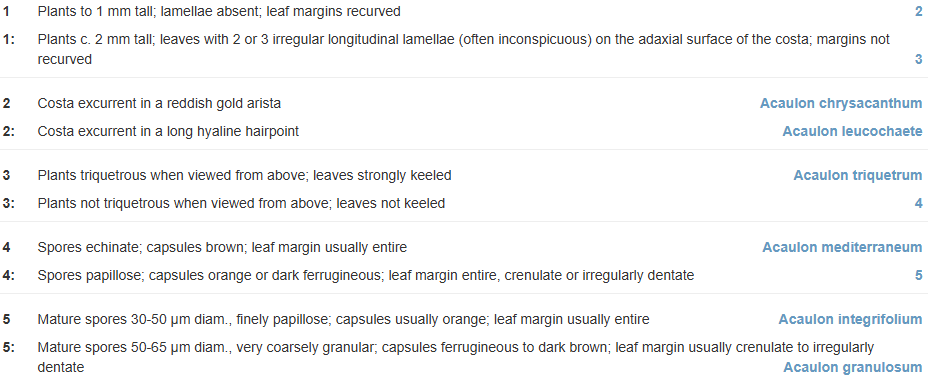

# Processing keys

## Anatomy of an identification key



<caption>

**Figure 1.** Bracketed key from **KeyBase (2025)**. _Flora of Victoria: Key to
Acaulon species_. &lt;https://keybase.rbg.vic.gov.au/keys/show/12181&gt; [Seen:
24-05-2025].

</caption>


[[Example CSV import](./examples/key-import-example.csv)]

```php
[
    [
      "from" => 1,
      "text" => "Plants to 1 mm tall; lamellae absent; leaf margins recurved",
      "to" => 2,
    ],
    [
      "from" => 1,
      "text" => "Plants c. 2 mm tall; leaves with 2 or 3 irregular longitudinal lamellae (often inconspicuous) on the adaxial surface of the costa; margins not recurved",
      "to" => 3,
    ],
...,
    [
      "from" => 5,
      "text" => "Mature spores 30-50 µm diam., finely papillose; capsules usually orange; leaf margin usually entire",
      "to" => "Acaulon integrifolium",
    ],
    [
      "from" => 5,
      "text" => "Mature spores 50-65 µm diam., very coarsely granular; capsules ferrugineous to dark brown; leaf margin usually crenulate to irregularly dentate",
      "to" => "Acaulon granulosum",
    ],
  ]
```

 

<caption>

**Figure 2** Graph of key in figure 1. In this graph the circles are couplets, arrows are leads and rectangles are the keyed out items. 

</caption>


```bash
> $from = collect($inkey)->map(fn ($lead) => $lead['from'])->toArray();
= [
    1,
    1,
    2,
    2,
    3,
    3,
    4,
    4,
    5,
    5,
  ]
```

```bash
> array_count_values($from);
= [
    1 => 2,
    2 => 2,
    3 => 2,
    4 => 2,
    5 => 2,
  ]
```

```bash
> $to = collect($inkey)->map(fn ($lead) => $lead['to'])->toArray();
= [
    2,
    3,
    "Acaulon chrysacanthum",
    "Acaulon leucochaete",
    "Acaulon triquetrum",
    4,
    "Acaulon mediterraneum",
    5,
    "Acaulon integrifolium",
    "Acaulon granulosum",
  ]
```

```bash
> $toCouplets = collect($to)->filter(fn ($item) => is_numeric($item))->toArray();
= [
    0 => 2,
    1 => 3,
    5 => 4,
    7 => 5,
  ]
```

```bash
> array_count_values($toCouplets);
= [
    2 => 1,
    3 => 1,
    4 => 1,
    5 => 1,
  ]
```

```bash
> $toItems = collect($to)->filter(fn ($item) => !is_numeric($item))->toArray();
= [
    2 => "Acaulon chrysacanthum",
    3 => "Acaulon leucochaete",
    4 => "Acaulon triquetrum",
    6 => "Acaulon mediterraneum",
    8 => "Acaulon integrifolium",
    9 => "Acaulon granulosum",
  ]
```


## Pitfalls

### Singleton couplets [**Error**]


<caption>

**Figure ...** Graph of key with singleton couplet. [[Example CSV import](./examples/key-import-singleton-example.csv)]

</caption>

```bash
> array_count_values($from);
= [
    1 => 2,
    2 => 2,
    3 => 2,
    4 => 1,
    5 => 2,
  ]
```

### Polytomies [**Warning**]


<caption>

**Figure ...** Graph of key with polytomy. [[Example CSV import](./media/decision-tree-polytomy.drawio.svg)]

</caption>

```bash
> array_count_values($from);
= [
    1 => 2,
    2 => 2,
    3 => 2,
    4 => 2,
    5 => 3,
  ]
```


### Orphans [**Error**]


<caption>

**Figure ....** Graph of key with orphan couplet. [[Example CSV
import](./examples/key-import-orphan-example.csv)]

</caption>

```bash
> array_diff($from, $toCouplets);
= [
    0 => 1,
    5 => 6,
  ]
```

### Dead ends [**Error**]


<caption>

**Figure ...** Graph of key with dead end. [[Example CSV import](./examples/key-import-dead-end-example.csv)]

</caption>

```bash
> array_diff($toCouplets, $from);
= [
    5 => 7,
  ]
```

### Loops [**Error**]


<caption>

**Figure ...** Graph of key with loop. [[Example CSV
import](./examples/key-import-loop-example.csv)]

</caption>

```php
class ErrorCheckService extends Service {
    private $from;
    private $to;
    private $loops;

    public function __construct($inKey)
    {
        $this->from = $inKey->map(fn ($lead) => $lead['from'])->toArray();
        $this->to = $inKey->map(fn ($lead) => $lead['to'])->toArray();
    }

    public function checkForLoops()
    {
        $this->loops = [];
        $this->traverseKey([], $this->from[0]);
        return $this->loops;
    }
    
    private function traverseKey($path, $node) 
    {
        $path[] = $node;
        
        foreach (array_keys($this->from, $node) as $lead) {
            $goTo = $this->to[$lead];
            if ($goTo) { // not an orphan 
                if (in_array($goTo, $this->from)) { // goTo is a couplet (not an item)
                    if (in_array($goTo, $path)) { // goTo is on path: append to loops array
                        $this->loops[$lead] = $goTo;
                    }
                    else { // goTo is not on path: go to next couplet
                        $this->traverseKey($path, $goTo);
                    }
                }
            }
        }
    }
}
```

### Reticulations [**Warning**]


<caption>

**Figure ...** Graph of key with reticulation. [[Example CSV import](./examples/key-import-reticulation-example.csv)]

</caption>

```bash
> array_count_values($toNodes);
= [
    2 => 2,
    3 => 1,
    4 => 1,
    5 => 1,
  ]
```


<caption>

**Figure ...** Graph of key with reticulation resolved by repeating the subgraph.

</caption>


<caption>

**Figure ...** Graph of key with reticulation resolved by starting a new graph.

</caption>


This will find the reticulations in a key:

```bash
> $reticulations = collect(array_unique($toCouplets))->filter(fn ($value) => array_count_values($toCouplets)[$value] > 1)->toArray();
= [
    2,
  ]
```

And this will tell you for each lead `$i` if it leads to a reticulation:

```php
array_count_values($toCouplets)[$lead[$i]['to']] > 1
```


### Subkeys [**Info**]


<caption>

**Figure ...** Graphs of key with subkeys. **A.** decision tree; **B.** leads
graph. 

</caption>


```bash
> $subkeys = collect($inkey)->map(fn ($lead) => $lead['subkey'])->unique()->values()->all()
= [
    "Group 1",
    "Group 2",
    "Group 3",
  ]
```

```bash
> $to[0] = collect($inkey)->map(fn ($lead) => $lead['to'])->toArray();
= [
    "Group 1",
    2,
    "Group 2",
    3,
    "Group 3",
    "Cercis",
  ]
```

```bash
> $toItems[0] = array_diff(collect($to[0])->filter(fn ($item) => !is_numeric($item))->toArray(), $subkeys);
= [
    5 => "Cercis",
  ]
```


### Shortcut [**Info**]


<caption>

**Figure ...** Graph for lead with a 'to' item provided as `Senegalia:Senegalia
greggii`. **A.** shortcut as implemented in KeyBase; **B.** longcut with a
single-lead `Key to the species of Senegalia`.

</caption>


<caption>

**Figure ...** Example of double shortcut (`Brachychiton:Brachychiton populneus:Brachychiton populneus subsp. populneus`) from **KeyBase (2025).** _Flora of Victoria: Key to the genera of Sterculiaceae_. &lt;https://keybase.rbg.vic.gov.au/keys/show/2252&gt; [Seen: 25-05-2025]. Currently KeyBase does not handle this situation well.

</caption>

## Processing key files
