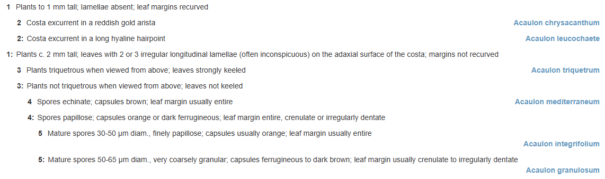

# Processing keys

## Anatomy of an identification key


<caption>

**Figure 1.** Bracketed key from **KeyBase (2025)**. _Flora of Victoria: Key to
Acaulon species_. &lt;https://keybase.rbg.vic.gov.au/keys/show/12181&gt; [Seen:
24-05-2025].

</caption>



<caption>

**Figure 2.** Same key as in figure 1 displayed as an indented key.

</caption>

[[Example CSV import](./examples/key-import-example.csv)]


 

<caption>

**Figure 3** Graph of key in figure 1. In this graph the circles are couplets,
arrows are leads and rectangles are the keyed out items. 

</caption>


<caption>

**Figure 4.** Conversion of decision tree to graph of leads that is stored in
KeyBase.

</caption>


<caption>

**Figure 5.** Bracketed key in the KeyBase data model, showing couplets.

</caption>


<caption>

**Figure 6.** Indented key in the KeyBase data model, showing nested sets.

</caption>

```php
$inKey = [
    [
      "from" => 1,
      "text" => "Plants to 1 mm tall; lamellae absent; leaf margins recurved",
      "to" => 2,
    ],
    [
      "from" => 1,
      "text" => "Plants c. 2 mm tall; leaves with 2 or 3 irregular longitudinal lamellae (often inconspicuous) on the adaxial surface of the costa; margins not recurved",
      "to" => 3,
    ],
...,
    [
      "from" => 5,
      "text" => "Mature spores 30-50 µm diam., finely papillose; capsules usually orange; leaf margin usually entire",
      "to" => "Acaulon integrifolium",
    ],
    [
      "from" => 5,
      "text" => "Mature spores 50-65 µm diam., very coarsely granular; capsules ferrugineous to dark brown; leaf margin usually crenulate to irregularly dentate",
      "to" => "Acaulon granulosum",
    ],
  ]
```

```bash
> $from = collect($inKey)->map(fn ($lead) => $lead['from'])->toArray();
= [
    1,
    1,
    2,
    2,
    3,
    3,
    4,
    4,
    5,
    5,
  ]
```

```bash
> $to = collect($inKey)->map(fn ($lead) => $lead['to'])->toArray();
= [
    2,
    3,
    "Acaulon chrysacanthum",
    "Acaulon leucochaete",
    "Acaulon triquetrum",
    4,
    "Acaulon mediterraneum",
    5,
    "Acaulon integrifolium",
    "Acaulon granulosum",
  ]
```

```bash
> $toCouplets = collect($to)->filter(fn ($item) => is_numeric($item))->toArray();
= [
    0 => 2,
    1 => 3,
    5 => 4,
    7 => 5,
  ]
```

```bash
> $toItems = collect($to)->filter(fn ($item) => !is_numeric($item))->toArray();
= [
    2 => "Acaulon chrysacanthum",
    3 => "Acaulon leucochaete",
    4 => "Acaulon triquetrum",
    6 => "Acaulon mediterraneum",
    8 => "Acaulon integrifolium",
    9 => "Acaulon granulosum",
  ]
```

## Pitfalls and things to look out for

### Singletons [**Error**]


<caption>

**Figure 7.** Graph of key with singleton couplet. [[Example CSV import](./examples/key-import-singleton-example.csv)]

</caption>

`CODE`

To check for the presence of singletons in a key:

```bash
> $singletons = collect(array_unique($from))->filter(fn ($value) => array_count_values($from)[$value] == 1)->toArray();
= [
    6 => 4,
  ]
```

To check whether a lead with index `$i` is a singleton:

```php
$isSingleton = array_count_values($from)[$inKey[$i]] == 1 ? true : false;
```

### Polytomies [**Warning**]


<caption>

**Figure 8.** Graph of key with polytomy. [[Example CSV import](./media/decision-tree-polytomy.drawio.svg)]

</caption>

To check for the presence of polytomies in a key:

```bash
> $polytomies = collect(array_unique($from))->filter(fn ($value) => array_count_values($from)[$value] > 2)->toArray();
= [
    10 => 6,
  ]
```

To check for a single lead with index `$i` whether it is part of a polytomy:

```php
$isInPolytomy = array_count_values($from)[$inKey[$i]['from']] > 2 ? true : false;
```


### Orphans [**Error**]


<caption>

**Figure 9.** Graph of key with orphan couplet. [[Example CSV
import](./examples/key-import-orphan-example.csv)]

</caption>

To check for the presence of orphans in a key:

```bash
> $orphans = array_slice(array_diff($from, $toCouplets), 1);
= [
    6,
  ]
```

The check whether a lead with index `$` is an orphan:

```php
$isOrphan = in_array($inKey[$i], $orphans) ? true : false;
```

### Dead ends [**Error**]


<caption>

**Figure 10.** Graph of key with dead end. [[Example CSV import](./examples/key-import-dead-end-example.csv)]

</caption>

To check if there are dead ends in a key:

```bash
> $deadEnds = array_diff($toCouplets, $from);
= [
    5 => 7,
  ]
```

To check if a lead with index `$i` is a dead end:

```php
$isDeadEnd = in_array($inKey[$i]['to'], $deadEnds) ? true : false; 
```

### Loops [**Error**]


<caption>

**Figure 11.** Graph of key with loop. [[Example CSV
import](./examples/key-import-loop-example.csv)]

</caption>

```php
class ErrorCheckService extends Service {
    private $from;
    private $to;
    private $loops;

    public function __construct($inKey)
    {
        $this->from = $inKey->map(fn ($lead) => $lead['from'])->toArray();
        $this->to = $inKey->map(fn ($lead) => $lead['to'])->toArray();
    }

    public function checkForLoops()
    {
        $this->loops = [];
        $this->traverseKey([], $this->from[0]);
        return $this->loops;
    }
    
    private function traverseKey($path, $node) 
    {
        $path[] = $node;
        
        foreach (array_keys($this->from, $node) as $lead) {
            $goTo = $this->to[$lead];
            if ($goTo) { // not an orphan 
                if (in_array($goTo, $this->from)) { // goTo is a couplet (not an item)
                    if (in_array($goTo, $path)) { // goTo is on path: append to loops array
                        $this->loops[$lead] = $goTo;
                    }
                    else { // goTo is not on path: go to next couplet
                        $this->traverseKey($path, $goTo);
                    }
                }
            }
        }
    }
}

$service = new ErrorCheckService($inkey)
```

To check for loops in a key:

```bash
> $loops = $service->checkForLoops();
= [
   6,
  ]
```

To check if a lead with index `$i` creates a loop:

```php
$isLoop = in_array($inKey[$i]['to'], $loops) ? true : false;
```

### Reticulations [**Warning**]


<caption>

**Figure 12.** Graph of key with reticulation. [[Example CSV import](./examples/key-import-reticulation-example.csv)]

</caption>


<caption>

**Figure 13.** Graph of key with reticulation resolved by repeating the subgraph.

</caption>


<caption>

**Figure 14.** Graph of key with reticulation resolved by starting a new graph.

</caption>

This will find the reticulations in a key:

```bash
> $reticulations = collect(array_unique($toCouplets))->filter(fn ($value) => array_count_values($toCouplets)[$value] > 1)->toArray();
= [
    2,
  ]
```

And this will tell you for each lead `$i` if it leads to a reticulation:

```php
array_count_values($toCouplets)[$lead[$i]['to']] > 1
```


### Subkeys [**Info**]


<caption>

**Figure 15.** Key with subkeys.

</caption>

To check if a key has subkeys:

```bash
> $hasSubkeys = collect($inKey)->filter(fn ($lead) => isset($lead['subkey']))->count() ? true : false;
= true
```

```bash
> $subkeyLabels = collect($inkey)->map(fn ($lead) => $lead['subkey'])->unique()->values()->all()
= [
    "Group 1",
    "Group 2",
    "Group 3",
  ]
```

```php
$subkeys = [];

$subkeys['main'] = collect($inKey)->filter(fn ($lead) => !isset($lead['subkey']))->toArray();

foreach ($subkeyLabels as $label) {
    $subkeys[$label] = collect($inkey)->filter(fn ($lead) => isset($lead['subkey']) && $lead['subkey'] == $label)->toArray()
}
```

```bash
> $to = collect($subkeys['main'])->map(fn ($lead) => $lead['to'])->toArray();
= [
    "Group 1",
    2,
    "Group 2",
    3,
    "Group 3",
    "Cercis",
  ]
```

```bash
> $toItems[0] = array_diff(collect($to[0])->filter(fn ($item) => !is_numeric($item))->toArray(), $subkeys);
= [
    5 => "Cercis",
  ]
```


### Shortcut [**Info**]


<caption>

**Figure 16.** Examples of shortcuts in keys. **A.** Single shortcut:
`Senegalia:Senegalia greggii` in **KeyBase (2025)**, _Vascular plants of
California: Jepson Herbarium, UC Berkeley: Fabaceae Group 1_.
&lt;https://keybase.rbg.vic.gov.au/keys/show/10038&gt; [Seen: 26-05-2025];
**B.** double shortcut: `Brachychiton:Brachychiton populneus:Brachychiton
populneus subsp. populneus` in **KeyBase (2025).** _Flora of Victoria: Key to
the genera of Sterculiaceae_.
&lt;https://keybase.rbg.vic.gov.au/keys/show/2252&gt; [Seen: 25-05-2025].

</caption>

## Processing key files

- Convert CSV file to multidimensional array; detect delimiters and headers
- DEBUG
- Upload key: [KeyUploadService](https://github.com/rbgvictoria/keybase-ws/blob/master/libraries/KeyUploadService.php)